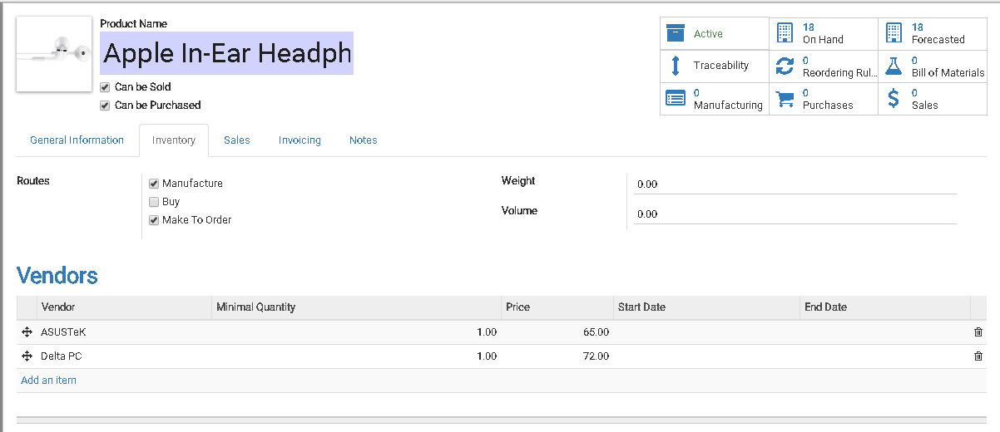
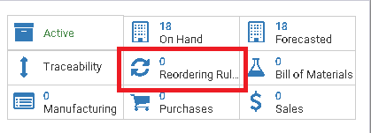
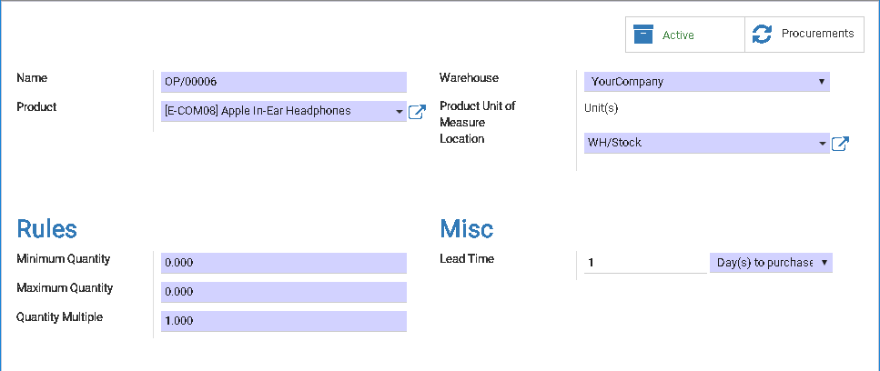
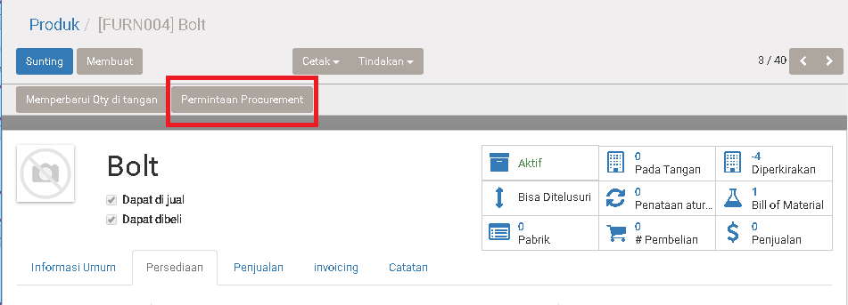
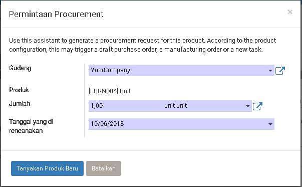

# Persediaan

## Introduction

Di topic ini kita ingin membahas cara untuk mengadakan persediaan di inventory kita.<br>
Di system odoo kita bisa melakukan persediaan inventory dengan cara berikut:<br>

1. Buy = Melalui beli sama vendor 
2. Manufacture =  Melalui produksi

Kita perlu identify produk yang bersifat `Beli` dan `Pabrik`. Setelah itu, kita
bisa setting dia di [Product > Persediaan > Rute](../master/product.md#persediaan)

Karena keseringan kita harus jaga inventory kita biar tetap ada stock untuk dipakai untuk penjualan dan dipakai untuk produksi. Maka di ODOO ada buat beberapa strategy untuk membantu user untuk meringankan kerjaan seperti ini.

1. Make-To-Order / MTO / Melalui Pesanan
2. Minimun Stock Rule
3. Permintaan Procurement
4. Manual Purchase Order

## Make-To-Order / MTO / Melalu Pesanan

Sesuai namanya **Order**, pengadaan ini akan ditrigger waktu kita dapat dari penjualan. <br>
Di lain kata, waktu kita mengadakan penjualan/sales order, system akan check apakah stock di inventory cukup untuk order ini?<br>
Bila tidak cukup, sesuai setting, system akan pilih apakah harus membuat
`Purchase Order (melalui beli sama vendor)` atau membuat `Manufacturing Order (Melalui Produksi)`.

### Make-To-Order - Buy

Melakukan Purchase Order/Pengadaan waktu kita menerima Sales Order/Penjualan.

Setting nya bisa di lakukan di [Product > Persediaan > Rute](../master/product.md#persediaan).


Steps:

1. Di `Rute` pilihlah **Make-To-Order** dan **Buy**
2. Isikan penyuplai di table **Vendor**

### Make-To-Order - Manufacture

Melakukan Manufacture Order/Produksi waktu kita menerima Sales Order/Penjualan.

Setting nya bisa di lakukan di [Product > Persediaan > Rute](../master/product.md#persediaan).



Steps:

1. Di `Rute` pilihlah **Make-To-Order** dan **Manufacture**
2. Product ini perlu ada Bill of Material(BOM)

Membuat BOM kita bisa membuat lewat tekan button di bawah ini, yang terletak di
form produk di sisi kanan atas:


```
Note:
Bill of Material adalah bahan-bahan yang di perlukan untuk merakit menjadi
produk
```

## Minimun Stock Rule


Dengan strategy ini, user perlu menentukan minimun quantity di Inventory yang mencukupi kebutuhan penjualan atau produksi.


Setting nya bisa di lakukan di [Product](../master/product.md).




### Membuat Rule




|Field|Required|Description|Default|
|-----|--------|-----------|-------|
|Name|Yes|Nama Rule.|System Generated|
|Product|Yes||Sesuai Product yang kita klik|
|Gudang|Yes|||
|Lokasi|Yes|Lokasi produk di check dan di kirim||
|**Peraturan**|
|Jumlah Minimun|Yes|System kan buatkan Purchase Order/Manufacturing order bila <br>kuantitas inventory sama atau lebih kurang dari kuantitas ini|0|
|Jumlah Maximun|Yes|System akan limit kuantitas order dengan<br>**Formula:**<br> `Kuantitas Order = Jumlah Maximun - Kuantitas Inventory` |0|
|Kuantitas Multiple|Yes|Biasa di gunakan untuk orderan per pallet/box<br>**Contoh:**<br> Kuantitas Multiple: 10<br> Jumlah Minimum: 5<br> Jumlah Maximun: 15<br> Kuantitas On-Hand: 4<br> Kuantitas yang order adalah: 15 - 4 = 11, 11 > 10 jadi minimun order 20 ||
|**Lain-Lain**|
|Lead Time|Yes|`Hari Untuk Membeli`<br>Hari membuat Order setelah kondisi minimun hit|Hari untuk membeli<br>|
|||`Hari Untuk Mendapatkan Produk`<br>Hari untuk mendapatkan produk di gudang||


Bila Produk sudah ada **Minimun Rule** di action button akan bentuk seperti gambar di bawah ini:


## Permintaan Procurement

Ini adalah cara permintaan semi-auto. Di gunakan bila user merasa produk ini perlu di beli atau di produksi.




### Membuat Permintaan Procurement




|Field|Required|Description|Default|
|-----|--------|-----------|-------|
|Gudang|Yes|Gudang Mana yang request||
|Jumlah|Yes|Kuantitas yang kita request||
|Tanggal di rencanakan|Yes|Tanggal Pengadaan yang kita harapkan||
