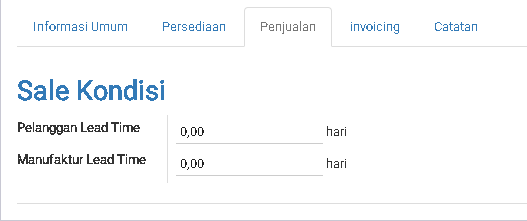

# Product

Product adalah basic dari segala proses yang ada di dalam 1 perusahaan.
Untuk menentukan proses akan bisa jalan dengan lancar jadi kita harus hati-hati
melakukan penambahan product.

## Basic Setting

|Field|Required|Description|Default|
|-----|--------|-----------|-------|
|Nama Product|Yes|||
|Dapat di jual|-|Produk ini di pakai untuk dijual?|Yes|
|Dapat di beli|-|Produk ini di pakai untuk dibeli?|Yes|

## Informasi Umum

|Field|Required|Description|Default|
|-----|--------|-----------|-------|
|Tipe Product|Yes|`Product Stockable`  Product yang akan di opnum|Product Stockable|
|||`Dapat di konsumsi`  Produk yang di konsumsi tidak untuk opnum||
|||` Service `  Produk yang bersifat servis||
|Referensi Internal|No|Kode Barang||
|Kategori Internal|Yes|Kategori barang||
|Harga Jual|No|Harga yang di pakai untuk membuat sale|0.00|
|Biaya|No|Biaya untuk produk ini|0.00|
|Satuan Ukuran|Yes|Satuan dasar yang di pakai oleh Gudang untuk melakukan  stock opnum.|Unit|
|Unit ukur Pembelian|Yes|Satuan yang di pakai untuk membeli produk ini dari  supplier.  `Saos Tomat memakai "Satuan Ukuran Botol"`  `tetapi membelinya dengan satuan ukuan "Lusin"`|Unit|
|Pengaturan Tagihan Pembelian|Yes|`Jumlah Yang di Pesan` Waktu membuat pembayaran ke supplier mengunakan quantity PO|Pada Jumlah yang di terima|
|||`Pada jumlah yang di terima` Waktu membuat pembayaran ke supplier mengunakan quantity actual receiving||

## Persediaan

Kegunaan `Persediaan` adalah menentukan cara penyediaan product ini

|Field|Required|Description|Default|
|-----|--------|-----------|-------|
|Rute|No|`Pabrik` |Beli|
|||`Beli` ||
|||`Membuat Pesanan` ||
|Berat|No|Berat Produk ini|0.00|
|Volume|No|Volume Produk ini|0.00|

### Vendor

Tabel ini diisikan untuk menginformasikan vendor yang dapat supply product ini:

> Note: 
Tabel ini akan dipakai oleh system menentukan vendor pada kasus di bawah ini: 
1. Rute di pilih "Beli" dan "Membuat Pesanan" bersamaan". 
Waktu mendapat "Sale", system akan auto generasi "Draft Purchase Order". 
2. Ada menentukan [Minimun Stock Rule](#minimun-stock-rule)

|Field|Required|Description|Default|
|-----|--------|-----------|-------|
|Pemasok|Yes|Vendor yang menyuplai product ini||
|Nama Produk Pemasok|No|Di isi bila nama produk vendor tidak sama dengan nama internal kita||
|Kode Produk Pemasuk|No|Di isi bila `Referensi Internal` beda sama kode produk vendor||
|Lama Waktu Pengiriman|Yes|Berapa hari yang di perlukan vendor untuk mengirimkan barang sampai di tempat kita|1|
|Kuantitas Minimal|Yes|Ini di gunakan waktu kita ada setting [Minimun Stock Rule](#minimun-stock-rule). System akan membuat Draft Purchase Order sewaktu "On-Hand Qty" di bawah kuantitas ini|0|
|Kuantitas Minimal|Yes|Kuantitas minimal yang kita perlu Purchase Order ke vendor|0|
|Harga|Yes|Harga yang di jual oleh vendor ini. Bila isi 0, user bisa sesuaikan harga di purchase order|0|
|Masa Berlaku|Yes|Settingan Kadaluarsa untuk harga dari vendor ini|0|

## Penjualan

|Field|Required|Description|Default|
|-----|--------|-----------|-------|
|Pelangganan Lead Time|No|Berapa hari yang di perlukan untuk delivery produk sampai ke tujuan customer.Ini untuk menentukan tanggal pengiriman. **Formula:**  tanggal pengiriman= Tanggal Konfirmasi Sales Order + Pelanggan Lead Time **Contoh:**  Tanggal Konfimasi: 10 June 2018 Pelangganan Lead Time: 12. Jadi, Tanggal Pengiriman adalah: 22 June 2018.|0  `Note: 0 artinya pengiriman pada hari ini`|
|Manufaktur Lead Time|No|Berapa hari yang di perlukan untuk delivery produk sampai ke tujuan customer.Ini untuk menentukan tanggal pengiriman. **Formula:**  tanggal pengiriman= Tanggal Konfirmasi Sales Order + Pelanggan Lead Time **Contoh:**  Tanggal Konfimasi: 10 June 2018 Pelangganan Lead Time: 12. Jadi, Tanggal Pengiriman adalah: 22 June 2018.|0  `Note: 0 artinya pengiriman pada hari ini`|

## Invoicing

Untuk tab ini biasa tanggung jawah orang **Akun** yang membuat setting

|Field|Required|Description|Default|
|-----|--------|-----------|-------|
|Pelanggan|No|Pajak yang di pakai untuk pembelian||
|Penjual Pajak|No|Pajak yang di pakai untuk penjualan||
|Akun Perbedaan Harga|No|Akun yang dipakai bila terjadi perselisihan harga waktu jual/beli||
|Kebijakan Penagihan|No|Jumlah di Pesan : Menagih sesuai kuantitas yang di `order` customer| Jumlah di pesan|
|||Jumlah Terkirim : Menagih sesuai kuantitas yang `Terkirim` ke customer||

## Catatan

|Field|Required|Description|Default|
|-----|--------|-----------|-------|
|Deskripsi untuk Kutipan|No|Nama/Deskripsi yang di pakai waktu di terakan di Sales Order||
|Deskripsi untuk Penjual|No|Nama/Deskripsi yang di pakai waktu di terakan di Purchase Order||
|Deskripsi untuk hasil|No|Nama/Deskripsi yang di pakai waktu di terakan di Picking List(Inventory)||
