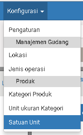
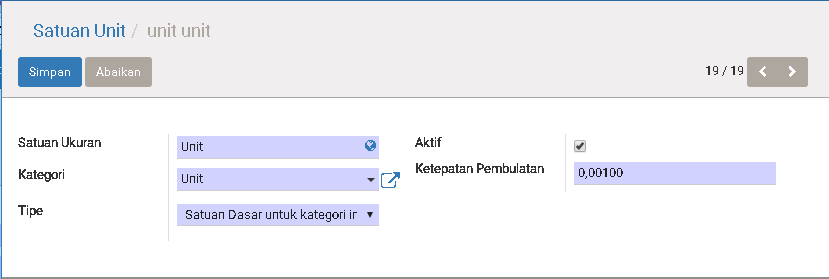

# Unit of Measure

## Introduction

Unit of Measure atau UOM atau Satuan Unit sangat penting di dalam bidang kita, karena dia akan muncul di mana-mana.
Contohnya: Di penjualan, Pembelian, Inventory, Stock, dll.

Apa yang buat di penting lagi?

Coba baca kasus di bawah ini:

PT. ABC membeli Salmon dari PT. GHZ dengan kuantitas besar yaitu hitungan nya
per `Ton`. Tetapi PT. ABC dalam bidang distribusi dan menjual Salmon dalam
quantity kecil ke consumer bisa sampai ke `Gram`. Tetapi, waktu stock opnum, PT.
ABC memakai `Kg` sebagai satuan pembukuan.

Jadi, PT. ABC perlu minimun 3 Satuan unit (Ton, Kg, Gram) untuk membantu proses bisnis mereka.

1. Membuat pembelian, Memakai `Ton`
2. Membuat penjualan, memakai `Kg` atau `Gram`
3. Pembukuan inventory memakai `Kg`

Biarpun bermacam-macam Satuan unit, di bantu oleh [Unit Ukuran Kategori](#unit-ukuran-kategori), kita bisa meng-group satuan-satuan unit. Dan biar bagaimanapun, waktu kita membaca pembukuan inventory atau akuntin, cuma satu [Satuan Unit](#satuan-unit) yang akan di keluarkan. System akan automasi
perhitungan segalanya, sesuai setting-an yang ada.

## Menu

> Persediaan > Konfigurasi > Satuan Unit

## Satuan Unit

|Field|Required|Description|Default|
|-----|--------|-----------|-------|
|Satuan Ukuran|Yes|Nama untuk satuan ukuran ini|-|
|Kategori|Yes|Ini untuk meng-group satuan unit Detail bisa liat di [SINI](#unit-ukuran-kategori)|-|
|Aktif|Yes|Menentukan apakah satuan unit ini masih aktif|Yes|
|Ketepatan Pembulanan|Yes|Menentukan cara pembulatan. **Contoh:**  Ketepatan Pembulatan: 0,001  Quantitas aktual: 8.97294  Quantitas setelah di bulatkan adalah: 8.973 |0,001|
|Tipe|Yes|`Satuan Dasar untuk kategori ini` Sebagai dasar dari Satuan Unit yang kategori sama. Nilainya akan selalu **1**|Satuan Dasar Untuk Kategori Ini|
|||`Lebih Besar Satuan Referensi`  Nilai nya lebih besar dari pada Satuan dasar||
|||`Lebih Kecil Satuan Referensi`  Nilai nya lebih Kecil dari pada Satuan dasar||
|Ratio|Yes|Field ini akan muncul bila **Tipe** adalah `Lebih Besar Satuan Referensi` atau `Lebih Kecil Satuan Referensi`|1,000|

### Contoh

Case 1: Berat

1 Ton = 1,000 Kg
1 Kg = 1,000 gram
dengan data atas contoh sebagai berikut:

1. Kita buatkan [Unit Ukuran Kategori](#unit-ukuran-kategori) untuk meng-group satuan unit yang akan di buat. Kita namakan dia **Berat**.
2. Buatkan [Satuan Unit](#satuan-unit) dengan data yang di bawah:  Satuan Ukuran: Kg Kategori: Berat Tipe: Satuan Dasar untuk Kategori ini
3. Buatkan [Satuan Unit](#satuan-unit) dengan data yang di bawah:  Satuan Ukuran: Ton Kategori: Berat Tipe: Lebih Besar Satuan Refensi Ratio: 1000
4. Buatkan [Satuan Unit](#satuan-unit) dengan data yang di bawah:  Satuan Ukuran: Gram Kategori: Berat Tipe: Lebih Kecil Satuan Refensi Ratio: 1000

Case 2: 

a) Produk **US Choice Short Rib** kita beli dengan satuan unit **Loaf**. 1 Loaf nya adalah 3 Kg.  
b) Produk **Beef Short Plate** kita beli dengan satuan unit **Loaf**. 1 Loaf nya adalah 4 Kg. 

Dengan kasus di atas kita bisa buatkan begitu:

1. Untuk (a), Buatkan [Satuan Unit](#satuan-unit) dengan data yang di bawah:  Satuan Ukuran: Loaf(3kg) Kategori: Berat Tipe: Lebih Besar Satuan Refensi Ratio: 3
2. Untuk (b), Buatkan [Satuan Unit](#satuan-unit) dengan data yang di bawah:  Satuan Ukuran: Loaf(4kg) Kategori: Berat Tipe: Lebih Besar Satuan Refensi Ratio: 4

## Unit Ukuran Kategori

|Field|Required|Description|Default|
|-----|--------|-----------|-------|
|Nama|Yes|Nama untuk kategori ini|-|
