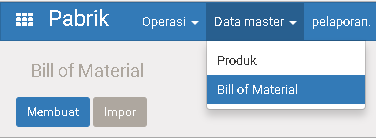
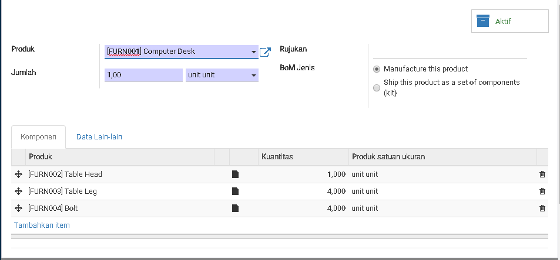

# Bill of Manufacture (BOM)

## Introduction

Bill of Manufacture adalah list of produk untuk mengolah menjadi produk lain.
 
Contohnya: Untuk produksi

**Produk: Smoke Salmon, 40pack** 
Perlu bahan-bahan sebagai berikut:

|Product|Jumlah|Satuan Unit|
|-------|-----:|:----------|
|Salmon Fresh|1200|gram|
|Kayu Bakar|10|Kg|

List di atas lah, kita menyebutkan nya sebagai Bill of Material.

## Menu

> Pabrik > Data Maste > Bill of Material

## Membuat Bill of Material

|Field|Required|Description|Default|
|-----|--------|-----------|-------|
|Produk|Yes|Produk Jadi|-|
|Jumlah|Yes|Kuantitas di produksi|-|
|Rujukan|No|Kode Resep bila ada|-|
|BoM Jenis|No|`Manufacture this Product`  Produk ini perlu di produksi|Manufacture this product|
|||`Ship this product as a set of components(kit)`  Produk perlu/tidak produksi dan bisa di kirim raw materialnya langsung  **Contoh:**  Product Jadi: Detergen ABC Promo Bulan Ramadhan  BoM Nya:   1. Detergen ABC:  1 Bks  2. Piring: 1 pcs  Bila ada orderan Untuk "Detergen ABC promo Bulan Ramadhan", akan di kirim langsung BoM nya

**Komponen**

|Field|Required|Description|Default|
|-----|--------|-----------|-------|
|Produk|Yes|||
|Kuantitas|Yes|||
|Satuan Unit|Yes|||
