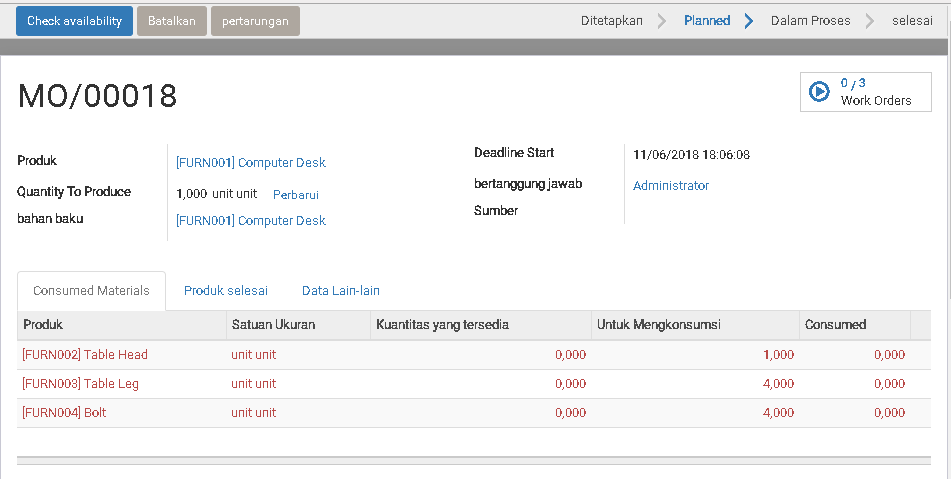
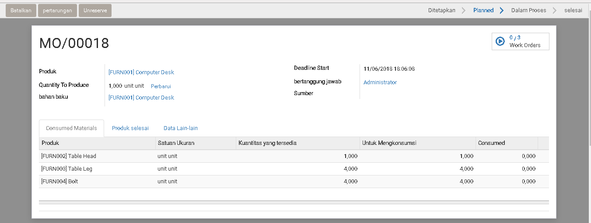
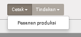
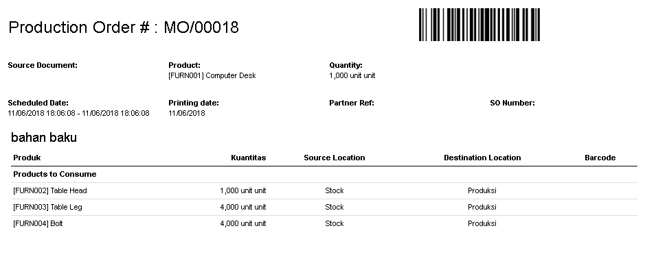
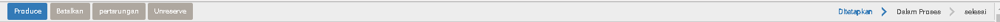
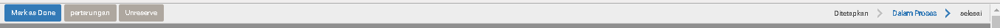

# Pesanan Manufaktur

Pesananan Manufaktur bisa kita buat manual atau bisa dapat di buat oleh system dengan cara [Make To Order](../inventory/persediaan.md#make-to-order-manufacture).<br>
<br>
Dengan "Pesanan Manufaktur" kita bisa monitor 2 proses:

1. Mengadakan pengambilan/picking raw material 
2. Memindahkan Produk Jadi ke gudang

## 1. Membuat Pesanan Manufaktur (Manual)


|Field|Required|Description|Default|
|-----|--------|-----------|-------|
|Produk|Yes|||
|Quantity To Produce|Yes|Jumlah yang kita perlukan||
|Bahan Baku|Yes|BoM yang kita akan pakai||
|Deadline Start|Yes|Tanggal yang harus kita sediakan produk jadi||
|Bertanggung Jawab|No|User yang tanggung jawab||
|Sumber|No|Nomor document untuk perintah pesanan ini||

Setelah data yang di data di isikan dengan benar:<br>


> Klik > Create Workorders



**Consume Materials** dan **Produk Selesai** akan di isikan automatik oleh system.

## 2. Check Kecukupan Bahan Baku

### a. Kondisi Bahan Baku Tidak Mencukupi


User bisa klik "Check Availibity" untuk mengechek apakah bahan baku cukup di
proses produksi ini.


```
Note:
Bila Bahan baku tidak memenuhi kebutuhan. System akan stop di sana dan user
tidak bisa melakukan proses next.
User perlu melakukan persediaan inventory untuk memenuhi kebutuhan.
```

### b. Kondisi Bahan Baku Mencukupi


Bila bahan baku itu mencukupi, di `Consume Materials > Kuantitas yang tersedia`
akan di isikan oleh system.


## 3. Pegambilan/Picking Bahan Baku

Print Manufacture Order (MO)/Pesanan Produksi sebagai perintah Produksi dan juga instruksi picking:



**Contoh Laporan Produksi dan juga Instruksi Picking**




## 4. Proses Produksi



> Klik > Produce

System akan meng-update status MO ini menjadi `Proses`



Setelah proses, system akan mengadakan pemotongan stock bahan baku dan
penambahan barang jadi di inventory.

User bisa lihat gerakan inventory dengan klik button seperti gambah di bawah
ini:


## 5. Pengecheckan Terakhir

Di step ini kita bisa lakukan check terakhir:

1. Apakah ada `Waste` yang harus kita laporan/rekor?
2. Bila tidak ada masalah, kita bisa **Complete** MO ini

### 1. Rekor Waste


> Klik > Pertarungan

System akan pop up form, user bisa isikan bahan baku yang di rekor sebagai waste

### 2. Produksi Selesai


> Klik > Mark as Done

Untuk menyelesaikan MO ini.
